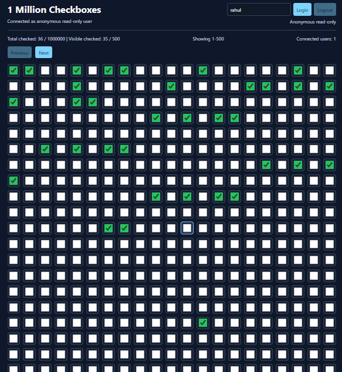
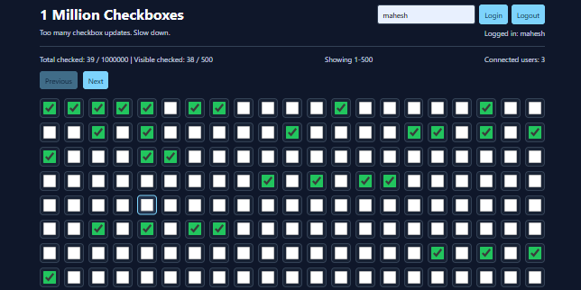

# 1 Million Checkboxes

Real-time checkbox grid built from scratch with Node.js, Express, Socket.IO, Redis, Redis Pub/Sub, custom rate limiting, and a local OAuth2/OIDC-style authentication flow.

The app is inspired by the "1 Million Checkboxes" concept. It does not render one million DOM nodes at once. Instead, it stores the full checkbox state compactly in Redis and loads the UI in chunks.

## Tech Stack

- Frontend: HTML, CSS, JavaScript modules
- Backend: Node.js, Express
- Real-time layer: Socket.IO WebSockets
- State and coordination: Redis bitmap + Redis Pub/Sub
- Auth: local OAuth2 authorization-code style flow with JWT access and ID tokens
- Rate limiting: custom Redis counter + expiry logic

## Features Implemented

- Large checkbox system with `CHECKBOX_COUNT` support
- Chunked frontend rendering, default 500 checkboxes per page
- Logged-in users can toggle checkboxes
- Anonymous users can connect and view state in read-only mode
- Real-time updates across browser windows
- Redis bitmap storage using `SETBIT`, `GETBIT`, `BITCOUNT`
- Atomic checkbox toggle using a Redis Lua script
- Redis Pub/Sub broadcast for multi-server coordination
- Custom HTTP rate limiting for auth and checkbox APIs
- Custom WebSocket rate limiting for toggle spam
- Socket connection, disconnection, and connected-user count handling
- Common + module-based project structure
- `.env.example` included

## Project Structure

```text
client/
  index.html
  style.css
  app.js
  js/
    common/
      config.js
    modules/
      auth/
        auth.api.js
      checkboxes/
        checkbox.api.js
        checkbox.socket.js
        checkbox.store.js
        checkboxGrid.js
        status.js

server/
  index.js
  app.js
  redis.js
  common/
    config/
      env.js
      redis.js
    constants/
      redisKeys.js
    middleware/
      httpRateLimit.middleware.js
    services/
      rateLimit.service.js
    utils/
      errorHandler.js
  modules/
    auth/
      auth.controller.js
      auth.middleware.js
      auth.routes.js
      auth.service.js
    checkboxes/
      checkbox.pubsub.js
      checkbox.routes.js
      checkbox.service.js
      checkbox.socket.js
```

## How To Run Locally

Install dependencies:

```bash
npm install
```

Create local env file:

```bash
cp .env.example .env
```

Start Redis with Docker:

```bash
docker run -d --name checkbox-redis -p 6379:6379 redis
```

Start the backend:

```bash
npm run dev
```

Open the frontend served by Express:

```text
http://localhost:5000
```

## Environment Variables

```env
PORT=5000
REDIS_URL=redis://127.0.0.1:6379
JWT_SECRET=replace-with-a-long-random-secret
CHECKBOX_COUNT=1000000
CHECKBOX_CHUNK_SIZE=500
OAUTH_CLIENT_ID=checkbox-web-client
OAUTH_ISSUER=http://localhost:5000
```

## Auth Flow

This project includes a local OAuth2/OIDC-style authentication server for the assignment demo.

1. The frontend sends a username to `POST /oauth/authorize`.
2. The server creates a short-lived authorization code and stores it in Redis.
3. The frontend exchanges the code at `POST /oauth/token`.
4. The server returns an access token and ID token.
5. The Socket.IO client sends the access token during connection.
6. Anonymous sockets are allowed to read state, but toggle actions are rejected.

OIDC discovery is exposed at:

```text
/.well-known/openid-configuration
```

User info is exposed at:

```text
/oidc/userinfo
```

## WebSocket Flow

1. Client connects to Socket.IO with an optional access token.
2. Server verifies the token and attaches user data to the socket.
3. Server emits `init` with checkbox stats and user status.
4. Logged-in users emit `toggle` with a checkbox index.
5. Server rate-limits the socket event.
6. Server toggles the Redis bitmap atomically.
7. Server publishes the update to Redis Pub/Sub.
8. Every server instance subscribed to the channel emits `update` to its clients.

## Redis Design

Checkboxes are stored in a Redis bitmap:

```text
checkboxes:bitmap
```

This is compact for a large checkbox system. One million checkbox states require about 125 KB of bitmap data.

The frontend requests chunks:

```text
GET /checkboxes?offset=0&limit=500
```

The response includes:

- `offset`
- `limit`
- `total`
- `checkedCount`
- `values`

## Rate Limiting Logic

No external rate-limit packages are used.

The custom limiter uses Redis:

1. `INCR rate:<scope>:<identity>`
2. If the counter is new, set `EXPIRE`
3. If the counter is above the configured max, reject the request

Used for:

- `/oauth/authorize`
- `/oauth/token`
- `/checkboxes`
- WebSocket `toggle`

Socket toggle limiting uses user ID plus socket ID so a single connected user cannot spam checkbox updates.

## Multi-Server Redis Pub/Sub

Each backend instance subscribes to:

```text
checkbox-updates
```

When a checkbox changes, the handling server publishes the update. All server instances receive the message and broadcast it to their own connected clients.

This allows the app to work when users are connected to different backend processes.


## Screenshots

### Checkbox Grid / Anonymous Mode

Shows the large checkbox grid loading in chunks while the user is connected in read-only anonymous mode.



### Real-Time Sync

Shows two logged-in users connected at the same time. Checkbox updates are synced between both browser windows through WebSockets and Redis Pub/Sub.


### Rate Limiting

Shows the custom WebSocket rate limiter rejecting rapid checkbox toggles after more than 2 updates in 5 seconds.



## Submission Links

- GitHub repository: add your public repo link here
- Live deployed link: add if available
- YouTube unlisted demo: add your YouTube link here

## Future Improvements

- Replace local demo OAuth with Google/Auth0/Clerk OIDC
- Add refresh tokens
- Add frontend virtualization instead of page chunks
- Add Redis connection health UI
- Add automated integration tests
